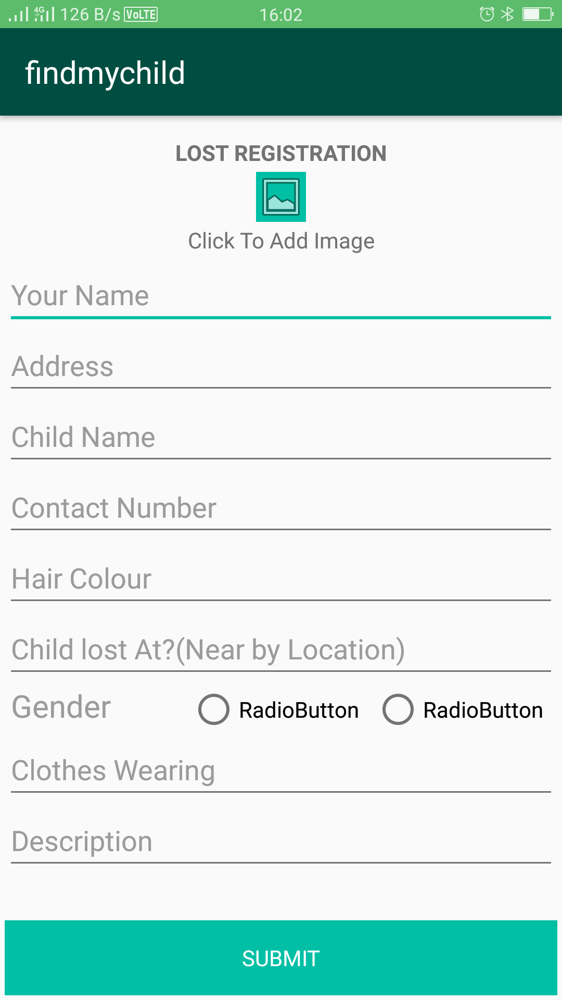
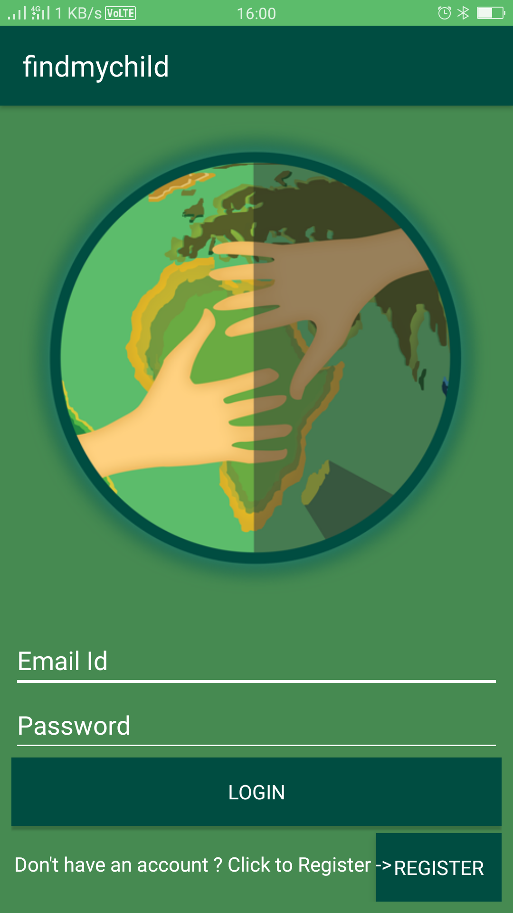

# Find-My-Child
An android app that helps people to relocate the lost child.

<h2>Screen shots</h2>

<h2>Installation</h2>

Clone the project from github. Extract the file and import it in Android Studio.Compile it and Run

<h2>Progress:</h2> <b>On Going</b>

<progress value="25" max="100">
</progress>

<h2>Contributers</h2>

<b>Barun Sarraf</b><i> (barunsarraf1@gmail.com)</i>

